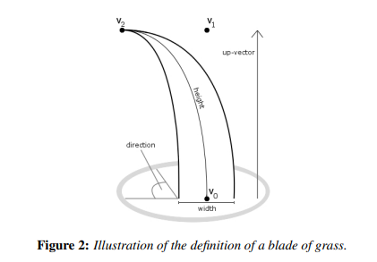
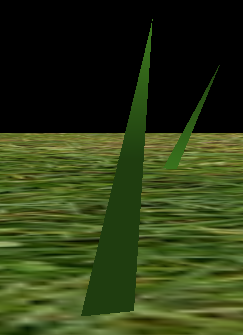
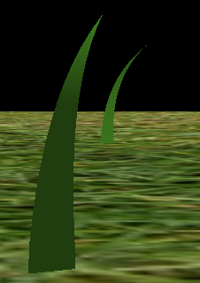
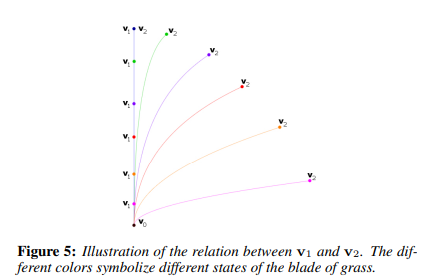
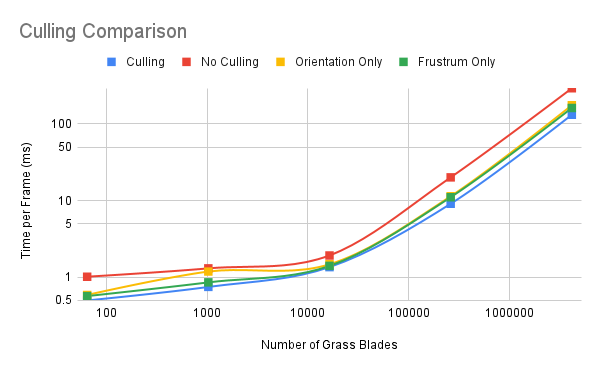
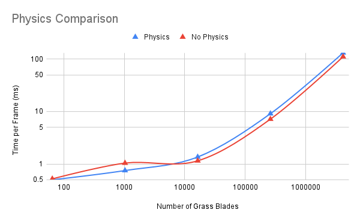
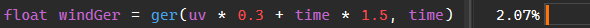
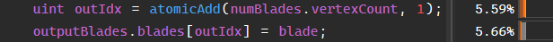

Vulkan Grass Rendering
==================================

**University of Pennsylvania, CIS 565: GPU Programming and Architecture, Project 5**

&nbsp;Avi Serebrenik

&nbsp;\* [LinkedIn](https://www.linkedin.com/in/avi-serebrenik-a7386426b), [Personal Website](https://aviserebrenik.wixsite.com/cvsite)

&nbsp;\* Tested on: Windows 11, i7-13620H @ 2.4GHz 32GB, RTX 4070 8GB (Laptop)

## Overview

  
   
  <em>Around 65000 tessalated grass blades blowing in the wind</em>

This grass simulation was built in Vulkan using a pipeline with a compute shader for force and culling evaluation and tessellation shaders to provide nice grass detail dynamically on the GPU for fast, large scenes.

The implementation is based on the 2017 paper, [*Responsive Real-Time Grass Rendering for General 3D Scenes*](https://www.cg.tuwien.ac.at/research/publications/2017/JAHRMANN-2017-RRTG/JAHRMANN-2017-RRTG-draft.pdf) by Klemens Jahrmann and Michael Wimmer.

The grass blades are created on the CPU as merely four vec4s: base, tip, a middle control point, and an up vector, which also contain information about direction, width, height, and stiffness in their 4th value, as seen in this diagram:

  

These values are randomized within a realistic range, and then they are passed to the compute shader, which applies wind, gravity, and recovery forces, allowing for nice, realistic movement and look.
The compute shader also culls blades based on distance, orientation, and whether they're in the camera frustrum, optimizing performance before we pass these blades to the render pass.
Next, in the render pass, the values are simply multiplied by a model matrix in the vertex shader before being passed to the tessellation shaders.
The tessellation shaders then use our three given values to create a finer tessellated mesh dynamically on the GPU. To get nice curves for the blades, the middle control point is used in a Bezier curve
evaluation of the grass blade (together with the base and tip). The results speak for themselves.
<table align="center">
  <tr>
    <td align="center">
      
       
      <em>Tesselation with 1 level</em>
    </td>
    <td align="center">
      
       
      <em>Tesselation with 12 levels</em>
    </td>
  </tr>
</table>
Finally, in the fragment shader, the blades are simply colored with a Lambertian light evaluation.

The detailed methods and performance analysis of the project are below.

## Methods

The grass blade and Vulkan pipeline initialization are quite standard, and can be seen in the Blade.h and Blade.cpp files and the Renderer.cpp file, respectively. However, importantly, there are two buffers storing the grass blades. One, which is used to keep track of all blades, so that animation can persist from frame to frame even on culled blades, and a second, which only carries forward the blades that we currently want to render in the scene. These get evaluated in the compute shader.

The **Compute Shader** does the following in parallel on each grass blade:
  1. Compute wind flow using physically based Gerstner Waves for smooth water-like flow. I chose this algorithm because even though it is usually used for height fields for water, it visually produces a really nice rolling grass effect. My implementation is a modification of this Shadertoy water height field: [https://www.shadertoy.com/view/MtVcW1](https://www.shadertoy.com/view/MtVcW1)
  2. Compute gravitational pull (which is statically 9.8 acceleration downwards, but can be adjusted for other scenes).
  3. Compute recovery force, which uses grass stiffness to make sure that the blades don't fall down due to gravity or get completely blown away.
  4. Resolve these forces on each grass blade.
  5. Cull grass blades based on orientation to the camera, distance from the camera, and whether they're in the camera's viewing frustrum.

Next, we have the full rendering pass, which consists of the following shaders:
 1. **Vertex Shader:** which transforms the values to their appropriate positions with the model matrix and passes them along.
 2. **Tesselation Control Shader:** which sets the tesselation levels. I set it to be 12 for all of them, so that there is a nice, even level of tesselation, allowing for a symmetrical, smooth look, which I ended up preferring after playing around with the values. I also pass along my vec4s here, but importantly, I set my origin point to be the built-in gl_position, so that I can use it and access it easier down the line.
 3. **Tesselation Evaluation Shader:** here, I use the built-in tesselation UV coordinates with my control point vector, direction, and up vector to calculate interpolated positions and normals using De Casteljau’s algorithm. This final position and normal then gets passed along, together with the given UV.
 5. **Fragment Shader:** finally, I simply use the position and normal information to perform simple Lambertian shading. I do not use the UV, but if I had a grass texture, this is where I would apply it.

  
   
  <em>Interpolation of grass curvature based on midpoint (v1) and tip (v2)</em>

## Analysis

To analyze this method, I checked the runtime of a frame using NVIDIA Nsight with different numbers of grass blades. First, I compared the effect of culling as a whole, then separated out orientation and frustrum culling, and then I separately checked the speed of turning physics off. To keep things consistent, all this data was captured with the camera being at its starting position, which is at level with the grass, near the edge of the patch, looking at its center. The raw data can be seen in this table here, where the values are in ms.

| Num exponent | Num Blades | Culling | No Culling | Orientation Only | Frustrum Only | No Physics |
|-------------|------------|---------|------------|------------------|---------------|------------|
| 2^6         | 64         | 0.5     | 1.02       | 0.59             | 0.57          | 0.52       |
| 2^10        | 1,024       | 0.75    | 1.31       | 1.19             | 0.86          | 1.04       |
| 2^14        | 16,384      | 1.36    | 1.93       | 1.48             | 1.41          | 1.15       |
| 2^18        | 262,144     | 9.11    | 20.13      | 11.41            | 11.09         | 7.17       |
| 2^22        | 4,194,304    | 131.93  | 291.84     | 175.49           | 161.72        | 111.23     |

### Culling

  
   
  <em>Culling performance comparison chart</em>

As we can see from the chart and data above, culling overall provides a clear improvement, averaging around a 2x speedup, which seems relatively consistent, no matter the number of blades.
To take a closer look, I decided to test the culling types on their own; however, distance-based is too variable based on where the camera is, so I decided to omit that from the analysis.
Looking at the data, it seems like they actually provide quite similar amounts of speedup, and each on its own is generally closer to the full culling. Meaning, even some culling is much better than none, and the calculations needed to cull are barely anything compared to the time that they save. Although I will say that during my experiments, turning distance-based culling off while I was close to the scene (meaning none would be culled) had a noticeable speedup, so these culling functions should only be enabled if they are actually used, but even a little use matters (like in the 64-blade case).

### Physics

  
   
  <em>Physics performance comparison</em>

I expected this chart to be clear-cut, with the no-physics being flat faster, but for some reason, it's not at lower grass numbers. I initially thought this was due to how I measure things, but it was consistent upon multiple different measurements. I am a little baffled, and my best guess is that it is either due to something with compiler optimization throttling something, or the fact that no physics speeds some parts up unevenly, which makes the overall code stall.

I also wanted to measure the performance overhead of my wind calculation, since it is a little overkill for a scene like this and is about half my compute shader. However, all of the calculations seem quite fast, which is why a strict time comparison didn't yield any good results. So instead, I checked the total samples in the compute shader and the wind code within for a single frame. The frame chosen took 2.25ms, where the compute shader took up 21.26% of samples and the wind took up 3.50% of the total samples. While I don't think the correlation between samples % and time is 1-1, it is generally close, so we can say that the compute shader took up around 0.478ms, and wind took up 0.079ms of that - i.e. wind is responsible for around 16% of the compute shader's calculations, which is not negligable, but it's also not too bad. The overwhelming majority of this is the first function call, so while I kept the wind code in different functions for readability, I would recommend putting all the code in line for a little performance boost, even though the compiler should probably do it already.

  
   
  <em>The samples % of the first wind function call</em>

The biggest contributors were the atomic add for proper indexing of output blades (around 26% of the compute shader) and the output memory write (around 26.6% of the compute shader).

  
   
  <em>The samples % of the atomic add and writing the output</em>

